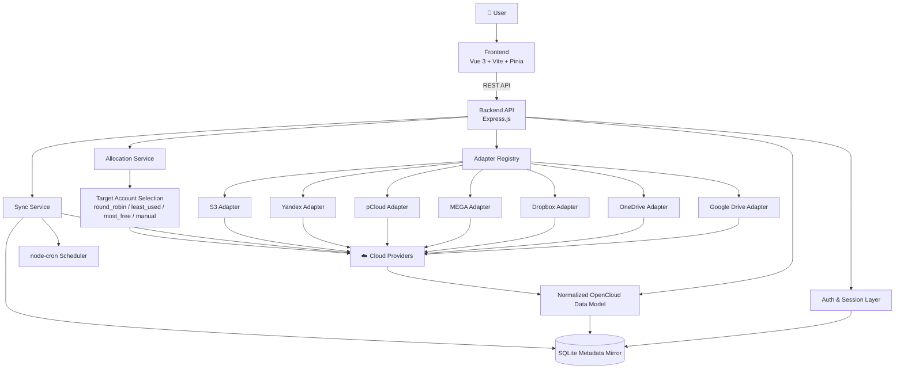
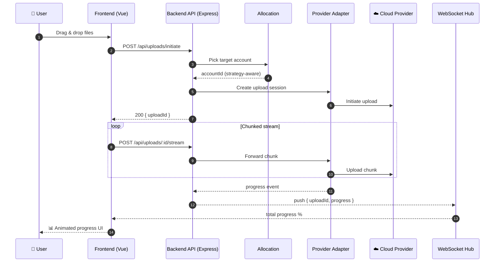
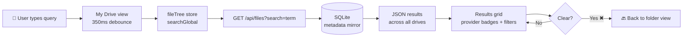
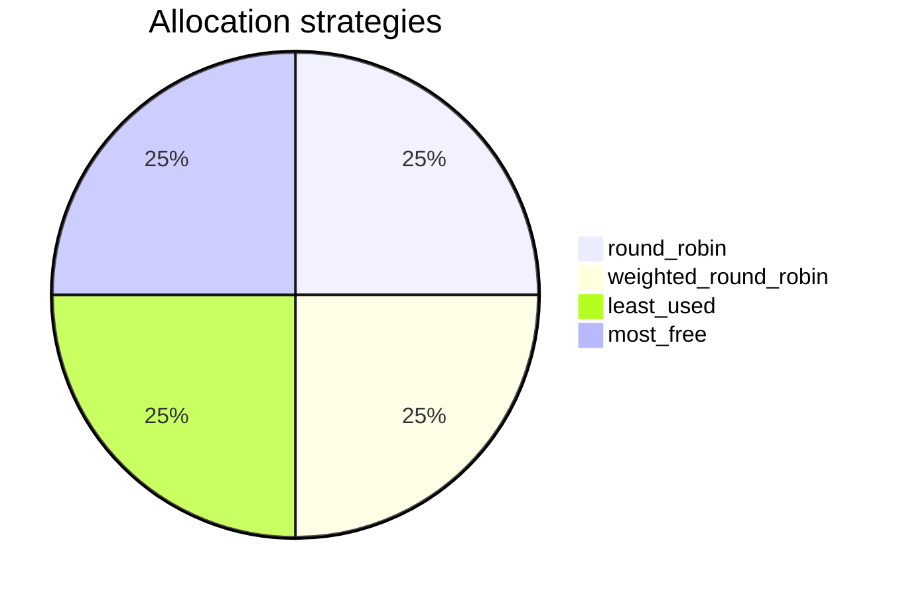

<div align="center">

<a href="#">
  
</a>

# ☁️ OpenCloud

**Aggregate every cloud drive you own into one fast, unified workspace.**

[](LICENSE)
[](https://github.com/sk143sathyabusiness/opencloud/stargazers)
[](https://github.com/sk143sathyabusiness/opencloud/network)
[](https://github.com/sk143sathyabusiness/opencloud/commits/main)

[](https://developer.mozilla.org/en-US/docs/Web/JavaScript)
[](https://vuejs.org/)
[](https://vitejs.dev/)
[](https://tailwindcss.com/)
[](https://pinia.vuejs.org/)
[](https://nodejs.org/)
[](https://expressjs.com/)
[](https://www.sqlite.org/)
[](https://github.com/WiseLibs/better-sqlite3)
[](https://developer.mozilla.org/en-US/docs/Web/API/WebSockets_API)

</div>

OpenCloud is a full‑stack **cloud drive aggregation platform**. It connects your Google Drive, OneDrive, Dropbox, MEGA, pCloud, Yandex Disk and S3‑compatible storage accounts and presents them through a single, consistent workspace — browse, search, upload, download and manage files across **all providers from one interface**.

Each provider is normalized behind an **adapter layer**, so every account feels identical: same file explorer, same metadata, same upload pipeline. A **SQLite metadata mirror** makes navigation and search lightning fast — no slow provider API round‑trips while you browse.


---

## ✨ Key Features

### ☁️ Multi-provider aggregation
- Connect **multiple accounts per provider** or many providers at once
- Uniform adapter layer normalizes every API into one data model
- OAuth, email/password and access‑key based connections, each handled natively

### 🔍 Global file search
- 🔎 Search **across every connected drive** from a single box
- ⏱️ Debounced, real-time results as you type
- 🧠 Multi-token & field matching — searches **file name, type, path, provider and account email**
- 🎛️ Optional filters: `provider`, `folder/file` type, and specific account
- 📁 Results keep the folder/file filters, star actions and previews you already know

### 🗂️ Unified file workspace
- Views for `Home`, `My Drive`, `Recent`, `Starred`, `Shared with Me` and `Quota`
- Virtual-path navigation that spans providers seamlessly
- Consistent metadata, icons and context actions across all sources

### 📁 File management
- Create, rename, delete (incl. bulk delete), download and move files & folders
- File details + inline preview for supported types
- Star / unstar files on providers that support it
- Type, owner and date filters in every view

### ⬆️ Upload pipeline
- Drag-and-drop, file & folder uploads straight to the target cloud
- Chunked streaming through a Node.js proxy with **real-time WebSocket progress**
- Automatic target-account picker using your **storage allocation strategy**

### 🔄 Sync & metadata mirror
- Scheduled background sync (`node-cron`) keeps local SQLite metadata fresh
- Manual sync trigger + delta sync reports through the health/sync layer

### 👤 Modes & personlisation
- `local` mode — personal / self-hosted single-user
- `hosted` mode — multi-user with cookie-based register/login/logout
- User-scoped accounts, file mirrors, allocation config and settings
- 🌐 **English & Indonesian (Bahasa Indonesia)** UI + light/dark themes

### ⚖️ Storage allocation strategies
`round_robin` · `weighted_round_robin` · `least_used` · `most_free` · `manual`

Spread uploads evenly, prefer the emptiest drive, or enforce your own account order.

---

## ☁️ Supported Providers

<p align="center">
  
  
  
  
  
  
  
</p>

| Provider            | Status | Integration model                                |
| ------------------- | ------ | ------------------------------------------------ |
| **Google Drive**    | ✅ Active | OAuth 2.0 + Google Drive API                    |
| **Microsoft OneDrive** | ✅ Active | OAuth 2.0 + Microsoft Graph                     |
| **Dropbox**         | ✅ Active | OAuth 2.0 + Dropbox API                          |
| **Yandex Disk**     | ✅ Active | OAuth 2.0 + Yandex Disk API                      |
| **MEGA**            | ✅ Active | Email / password account connection              |
| **pCloud**          | ✅ Active | Email / password account connection              |
| **S3-compatible**   | ✅ Active | Access key / secret key / endpoint configuration |

> Detailed credential setup for every provider lives in [`docs/provider-setup.md`](docs/provider-setup.md).

---

## 🔄 How OpenCloud Works

### Architecture


1. The frontend talks to the REST API for auth, accounts, files, uploads, settings and allocation
2. The backend picks the right adapter (`google_drive`, `onedrive`, `dropbox`, `mega`, `pcloud`, `yandex`, `s3`)
3. Provider responses are normalized into the OmniCloud data model
4. Metadata is mirrored into SQLite for instant navigation & search
5. The sync service keeps the local mirror aligned with provider state on a schedule

### Upload & real-time progress


### Global search flow


---

## 🧩 Application Views

| Route | View |
| ----- | ---- |
| `/` | 🏠 Home dashboard |
| `/my-drive` | 📁 Main unified file explorer |
| `/shared-with-me` | 🤝 Shared files from supported providers |
| `/recent` | 🕘 Recent files |
| `/starred` | ⭐ Starred files |
| `/quota` | 📊 Quota overview + account & allocation settings |
| `/login` · `/register` | 🔐 Auth pages (hosted mode) |

---

## 🛠️ Local Setup

### 1 · Requirements
- **Node.js 20+** (a current LTS release is recommended)
- **npm**
- Provider credentials for the cloud services you want to connect

### 2 · Install dependencies
```bash
npm install
```
> Workspaces: installs everything for `backend/` and `frontend/` automatically.

### 3 · Create the backend environment file
```bash
copy backend\.env.example backend\.env
```
> On macOS / Linux: `cp backend/.env.example backend/.env`

### 4 · Add environment variables
Full example (`backend/.env`):
```env
PORT=8787

# local = single-user · hosted = multi-user with login/register
APP_MODE=local

CORS_ORIGIN=http://localhost:5173
FRONTEND_URL=http://localhost:5173

SYNC_INTERVAL_MINUTES=5
OMNICLOUD_SECRET_HALF=replace-this-with-random-half-key

AUTH_COOKIE_NAME=omnicloud_session
AUTH_SESSION_TTL_HOURS=336
AUTH_SECRET=replace-this-with-a-strong-random-secret

GOOGLE_CLIENT_ID=
GOOGLE_CLIENT_SECRET=
GOOGLE_REDIRECT_URI=http://localhost:8787/api/accounts/google/callback

ONEDRIVE_CLIENT_ID=
ONEDRIVE_CLIENT_SECRET=
ONEDRIVE_TENANT_ID=common
ONEDRIVE_REDIRECT_URI=http://localhost:8787/api/accounts/onedrive/callback

DROPBOX_CLIENT_ID=
DROPBOX_CLIENT_SECRET=
DROPBOX_REDIRECT_URI=http://localhost:8787/api/accounts/dropbox/callback

YANDEX_CLIENT_ID=
YANDEX_CLIENT_SECRET=
YANDEX_REDIRECT_URI=http://localhost:8787/api/accounts/yandex/callback
```

Notes:
- **MEGA** & **pCloud** connect from the UI with email/password — no `.env` keys
- **S3-compatible** storage is configured from the UI (endpoint / bucket / keys)
- `APP_MODE=hosted` enables register/login/logout with session cookies

### 5 · Configure provider credentials
Follow the step-by-step guide: [`docs/provider-setup.md`](docs/provider-setup.md)

### 6 · Run it 🚀
```bash
npm run dev
```

| Endpoint  | URL                        |
| --------- | -------------------------- |
| 🌐 Frontend | `http://localhost:5173` |
| ⚙️ API      | `http://localhost:8787` |

---

## 🐳 Docker Setup

Run the API and the production frontend (behind Nginx) with Docker Compose.

```bash
copy backend\.env.example backend\.env
```
Then fill in credentials and secrets. For Compose, the app is exposed on **port 8080**, so OAuth redirects use proxied URLs:

```env
GOOGLE_REDIRECT_URI=http://localhost:8080/api/accounts/google/callback
ONEDRIVE_REDIRECT_URI=http://localhost:8080/api/accounts/onedrive/callback
DROPBOX_REDIRECT_URI=http://localhost:8080/api/accounts/dropbox/callback
YANDEX_REDIRECT_URI=http://localhost:8080/api/accounts/yandex/callback
```

```bash
docker compose up --build
```

- 🌐 Frontend: `http://localhost:8080`
- ⚙️ API (through Nginx): `http://localhost:8080/api`

Stop everything: `docker compose down`
Remove containers **and** the persisted SQLite volume: `docker compose down -v`

---

## 📜 Available Scripts

### Root
| Script | Description |
| ------ | ----------- |
| `npm run dev` | Frontend + backend in parallel |
| `npm run build` | Build production frontend |
| `npm run build:web` | Build only the frontend |
| `npm run dev:web` | Vite dev server |
| `npm run dev:api` | Backend with `node --watch` |
| `npm start` | Backend without watch mode |

### Frontend (`npm --prefix frontend`)
| Script | Description |
| ------ | ----------- |
| `npm --prefix frontend run dev` | Vite dev server |
| `npm --prefix frontend run build` | Production build |
| `npm --prefix frontend run preview` | Preview production build |

### Backend (`npm --prefix backend`)
| Script | Description |
| ------ | ----------- |
| `npm --prefix backend run dev` | API with file watch |
| `npm --prefix backend start` | API normally |

---

## 🔌 API Overview

### 💚 Health & sync
- `GET /api/health`
- `POST /api/sync/run`

### 🔐 Authentication
- `GET /api/auth/me` · `POST /api/auth/register` · `POST /api/auth/login` · `POST /api/auth/logout`

### 📎 Accounts
- `GET /api/accounts` · `DELETE /api/accounts/:id`
- `GET /api/accounts/{provider}/status`
- `GET /api/accounts/{provider}/connect` *(OAuth providers: google, onedrive, dropbox, yandex)*
- `POST /api/accounts/mega/connect` · `POST /api/accounts/pcloud/connect` · `POST /api/accounts/s3/connect`
- OAuth callback routes under `/api/accounts/*/callback`

### 📁 Files
- `GET /api/files`
- `GET /api/files?path=/`
- `GET /api/files?recent=1` · `GET /api/files?starred=1` · `GET /api/files?shared=1`
- 🔍 **`GET /api/files?search=term`** — global search across all drives
  - optional `provider`, `type` (file/folder), `accountId`, `limit`
- `GET /api/files/:id/shared-children` · `PATCH /api/files/:id/star` · `POST /api/files/bulk/delete`
- Plus detail, download, rename, create-folder and per-item delete routes in the file service / adapter workflow

### ⬆️ Uploads
- `POST /api/uploads/initiate`
- `POST /api/uploads/:uploadId/stream`
- `WS /ws/uploads?uploadId=…`

### ⚙️ Settings & allocation
- `GET /api/settings` · `PATCH /api/settings`
- `GET /api/allocation` · `PATCH /api/allocation`

---

## 🧠 Storage Allocation Behavior

When an upload starts, the backend selects the **target account** from your allocation configuration — so files spread across providers automatically (or by your exact preference).



Real-world examples:
- 🔁 Distribute uploads in rotation across several accounts
- 🕳️ Always fill the account with the most free space first
- 👐 Enforce a strict manual ordering you define

---

## 🗄️ Data Persistence

OpenCloud stores locally (in `backend/omnicloud.db`, SQLite):
- Mirrored file metadata
- Linked account metadata
- 🔒 Encrypted provider credentials / token material
- User settings
- Allocation config & rotation state
- Auth session data (hosted mode)

---

## 🔒 Security Notes

- ⛔ Never commit `backend/.env`
- ⛔ Never commit local production or personal test databases
- 🔑 Treat OAuth secrets, refresh tokens, session secrets, access keys and provider passwords as sensitive
- 🧩 `OMNICLOUD_SECRET_HALF` is part of the local encryption key material
- 🛡️ In `APP_MODE=hosted`, use a strong `AUTH_SECRET` and the correct frontend origin

---

## 🤝 Contributing

Contributions, issues and feature requests are welcome!

1. 🍴 Fork the repository
2. 🌿 Create a feature branch (`git checkout -b feat/awesome-thing`)
3. ✍️ Commit your changes (`feat: add awesome thing`)
4. 🚀 Open a Pull Request

---

## 📄 License

Distributed under the **MIT License**. See [LICENSE](LICENSE).

---

<div align="center">

**Made with ❤️ and lots of ☁️ — OpenCloud**

**⭐ Star it · 🍴 Fork it · 🚀 Ship it**

</div>